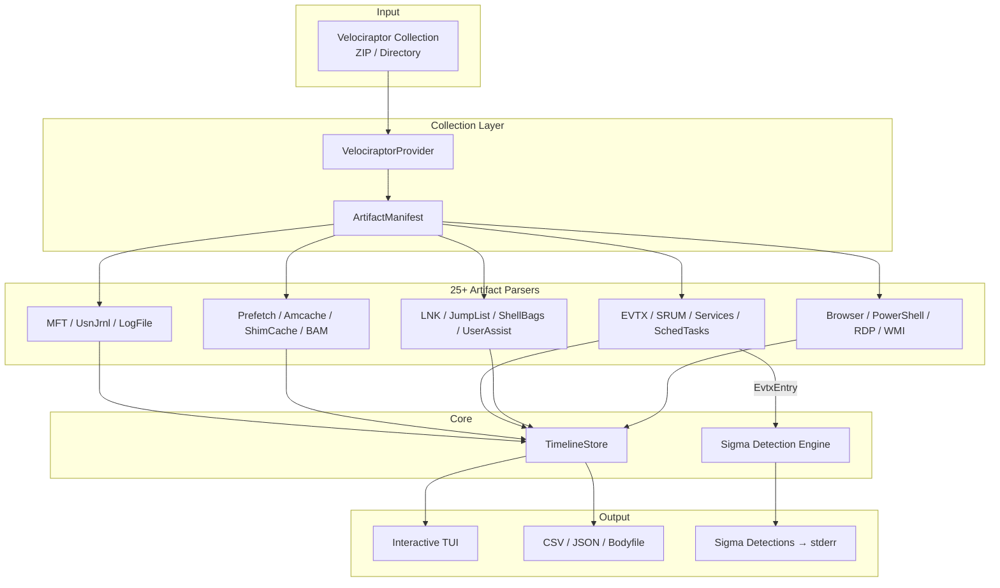

# tl - Rapid Forensic Triage Timeline

[](https://www.rust-lang.org/)
[](https://opensource.org/licenses/MIT)
[](https://github.com/h4x0r/tl)

**Author:** Albert Hui ([@h4x0r](https://github.com/h4x0r)) of [@SecurityRonin](https://github.com/SecurityRonin)

A fast forensic triage timeline generator that ingests Velociraptor collections and produces a unified, chronologically sorted timeline from 25+ Windows artifact types. Built in Rust with an interactive TUI, multiple export formats, and a built-in Sigma detection engine.

## How It Works

Point `tl` at a Velociraptor collection (ZIP or extracted directory). It auto-discovers artifacts, parses them in parallel, correlates entries across sources, and presents a unified timeline:

```
$ tl collection.zip
Collection: WORKSTATION1 (2025-01-15T10:30:00Z)
Source tool: Velociraptor
Artifacts found: 847 total files
  $MFT: found
  $UsnJrnl: found
  Event logs: 142, Prefetch: 38, LNK: 12, Registry hives: 8
Parsing $MFT...
  124,531 timeline entries from $MFT
Parsing $UsnJrnl:$J...
  45,892 USN records parsed
  MFT path resolver: 124,531 entries
Parsing execution evidence...
Parsing event logs...
[*] Evaluating 2847 rules against 89,234 events...
[!] 14 Sigma detections:
    [High] Mimikatz Usage | EID:4688 2025-01-14T22:15:03Z Security
    [Critical] Pass-the-Hash Activity | EID:4624 2025-01-14T22:15:08Z Security
```

## Supported Artifacts

### NTFS Filesystem
| Artifact | Parser | What It Provides |
|----------|--------|-----------------|
| `$MFT` | `mft_parser` | File creation/modification/access/MFT-modify timestamps, full path, file size, deleted files |
| `$UsnJrnl:$J` | `usn_parser` | Change journal: file creates, deletes, renames, close events with MFT path resolution |
| `$LogFile` | `logfile_parser` | Transaction log gap detection for anti-forensics |

### Execution Evidence
| Artifact | Parser | What It Provides |
|----------|--------|-----------------|
| Prefetch (`.pf`) | `prefetch_parser` | Program execution with timestamps, run count, loaded DLLs |
| Amcache | `amcache_parser` | Application execution and install history with SHA1 hashes |
| ShimCache | `shimcache_parser` | Application compatibility cache: execution evidence from SYSTEM hive |
| BAM/DAM | `bam_parser` | Background Activity Moderator: recent execution with user SID |
| Services | `services_parser` | Windows service install/config from SYSTEM registry |
| Scheduled Tasks | `schtask_parser` | Task creation and configuration from XML task files |

### User Activity
| Artifact | Parser | What It Provides |
|----------|--------|-----------------|
| LNK files | `lnk_parser` | Shortcut targets, timestamps, volume info, TrackerDataBlock |
| Jump Lists | `jumplist_parser` | Auto/custom destinations: recent files per application |
| UserAssist | `userassist_parser` | Program execution count and last run from NTUSER.DAT (ROT13 decoded) |
| ShellBags | `shellbag_parser` | Folder access history from NTUSER.DAT and UsrClass.dat |
| Recycle Bin | `recycle_bin_parser` | Deleted file metadata with original paths (`$I` files) |
| MRU Lists | `mru_parser` | RecentDocs, OpenSavePidlMRU, LastVisitedPidlMRU from registry |
| User Registry | `user_registry_parser` | WordWheelQuery, TypedPaths, TypedURLs from NTUSER.DAT |
| PowerShell History | `posh_history_parser` | `ConsoleHost_history.txt` command history per user |
| Browser History | `browser_parser` | Chrome, Edge, Firefox URL history with visit timestamps (SQLite) |
| Activities Cache | `activities_parser` | Windows Timeline (`ActivitiesCache.db`): app usage, document opens |
| RDP Bitmap Cache | `rdp_cache_parser` | Outbound RDP session evidence from bitmap cache tiles |

### System/Network
| Artifact | Parser | What It Provides |
|----------|--------|-----------------|
| Event Logs (`.evtx`) | `evtx_parser` | All Windows event logs: Security, System, PowerShell, Sysmon, etc. |
| SRUM | `srum_parser` | System Resource Usage Monitor: app resource usage, network connections, bytes sent/received |
| Autoruns | `autorun_parser` | Persistence mechanisms from Run/RunOnce registry keys |
| WMI Persistence | `wmi_parser` | WMI event subscriptions (MOF/OBJECTS.DATA) |
| Network History | `network_parser` | NetworkList registry: connected network names, dates, types |

## Sigma Detection Engine

`tl` includes a built-in Sigma rule engine that evaluates rules against parsed event log entries.

### Auto-download SigmaHQ community rules

```bash
tl collection.zip --sigma
```

On first run, this shallow-clones the [SigmaHQ](https://github.com/SigmaHQ/sigma) repository to `~/.cache/tl/sigma-rules/` (or platform-appropriate cache directory). Subsequent runs reuse the cache with a 24-hour debounce before pulling updates.

### Custom rules

```bash
tl collection.zip --sigma-rules /path/to/rules/
```

### Both combined

```bash
tl collection.zip --sigma --sigma-rules /path/to/extra-rules/
```

### What the engine supports

- **Field matching**: exact, `contains`, `startswith`, `endswith`, `re` (regex)
- **Modifiers**: `all` (all values must match), case-insensitive by default
- **Conditions**: `selection`, `selection and not filter`, `sel1 or sel2`, nested `AND`/`OR`/`NOT`
- **Levels**: informational, low, medium, high, critical
- **Recursive rule loading**: walks directories to find `.yml`/`.yaml` files

## Interactive TUI

The default mode launches a full-screen terminal interface:

| Key | Action |
|-----|--------|
| `j`/`k` or arrows | Navigate up/down |
| `J`/`K` | Jump 10 entries |
| `Ctrl-d`/`Ctrl-u` | Half-page down/up |
| `Ctrl-f`/`Ctrl-b` | Full-page down/up |
| `g`/`G` | Go to top/bottom |
| `/` | Incremental search |
| `n`/`N` | Next/previous match |
| `Enter` | Toggle detail pane |
| `q` | Quit |

## Export Formats

```bash
# CSV (for Excel, Splunk, Timeline Explorer)
tl collection.zip --export-csv timeline.csv

# JSON (for programmatic analysis, jq)
tl collection.zip --export-json timeline.json

# Bodyfile (mactime format, for Plaso/Sleuthkit interop)
tl collection.zip --export-bodyfile timeline.body
```

## Installation

```bash
git clone https://github.com/h4x0r/tl
cd tl
cargo build --release
# Binary at ./target/release/tl
```

### Requirements

- Rust 1.70+
- `git` (only needed if using `--sigma` for auto-downloading SigmaHQ rules)

## Architecture



## Event Types

The unified timeline normalizes entries into these event types:

`CREATE` `MOD` `ACC` `DEL` `REN` `MFT` `EXEC` `REG` `SVC_INSTALL` `SCHTASK` `LOGON` `LOGOFF` `PROC_CREATE` `NET_CONN` `BITS` `RDP`

## Testing

```bash
cargo test        # 445 tests across all modules
cargo test --lib  # 390 unit tests
```

## License

MIT
